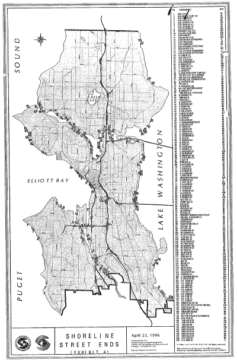

Seattle has a stock of inaccessible public shorelines that are just waiting for community groups to develop. 
I built a map of them which you can see at [SeattleShorelines.org](https://www.seattleshorelines.org). 

This past year I have been staying healthy by paddling with the [Seattle Outrigger Canoe Club](http://www.seattleoutrigger.com/). 
Seattle has incredible water resources, but much of the shoreline is inaccessible due to private ownership.
I went to high school in Minneapolis and took for granted the incredible public access to its many lakes and rivers.
As you can see on [their bike map](http://wwwdocs.minneapolismn.gov/bike/index.html), Minneapolis provides dedicated and connecting bicycle and pedestrian trails surrounding nearly every shoreline. 

This is a dramatic contrast to Seattle, where most of the waterfront is privately owned and inaccessible. 
For the most part, this is because the waterways in Seattle are connected to the Pacific Ocean, so commercial, industrial, and, recreational interests have long held sway.

One exception is [Waterway 18](https://washingtondnr.wordpress.com/2010/06/21/restoration-of-waterway-18-on-lake-union-complete/) near the iconic (but [contaminated](https://fortress.wa.gov/ecy/gsp/Sitepage.aspx?csid=2876)) Gas Works Park. 
At the outrigger club, we refer to Waterway 18 as "our beach", and I feel very grateful for it's existence every time we paddle out into the waters of Lake Union, which is three times a week. To me, it feels like luxury.

Our beach is small but it's an oasis of nature on a crowded waterfront. It hosts a family of [nutrias](http://wdfw.wa.gov/living/nutria.html), is a favored spot for raising goslings, and is used for fishing by cranes. Once, we even spotted a falcon hanging out. 

A couple years back, one of Seattle's two weekly newspapers The Stranger brought attention to undeveloped yet publicly owned waterfronts with the headline ["All of These Secret Seattle Beaches and Parks Belong to You - Use Them!"](https://www.thestranger.com/features/feature/2015/07/08/22508794/all-of-these-secret-beaches-and-parks-belong-to-you-seattle-use-them).
What a great opportunity to improve the city! The City of Seattle even [has a program](http://www.seattle.gov/transportation/stuse_stends.htm) to support neighborhood groups to apply for permits to develop these sites. 

As the article details, many of these sites are hard to find. Because I've been on the water so much recently, I have noticed that the value of these sites is made much more vivid when you can actually see where they are. Many of them are entirely unfindable from land due to overgrowth or encroachment. What's needed is greater awareness of the location of each individual site. My belief is that neighborhood groups will organize to develop theses sites when they realize that they are there.

Unfortunately, [the map the city provides](http://seattlecitygis.maps.arcgis.com/home/webmap/viewer.html?webmap=57fc67a4e679415ba3772df17ab6d48c&extent=-122.5985,47.4953,-122.0915,47.7177) is clunky, and pretty much unusable on mobile. This bothered me because I have thought a lot about maps and how to build effective accessible interactive maps. This was the focus of my work at Empower Engine. I try to stay current with mapping technologies and have delivered [multiple](http://slides.com/noahg/maps) [talks](http://slides.com/noahg/maps-online) and workshops on the subject.

I have also been looking for a good reason to build something with [Angular 2](https://angular.io/). Hence, [SeattleShorelines.org](https://www.seattleshorelines.org) was born. All of the images and data on the site is directly from SDOT. In the coming months, I hope to organize a day of action to gather better photos and descriptions. If you're interested please join the mailing list on the site.

It turns out that the original legislation includes a xerox of a paper map. I thought it was pretty cool to see especially with respect to my criticisms of SDOT's ArcGIS based web-map. 

The SDOT map isn't that different from the xeroxed map, save for terrain base layer and pop ups. For my map remake I decided to put the focus on the site photos. They consume the whole left half of the screen in landscape, and the whole screen by default in portrait. 

If you want to help on the tech side, here's the [Github repo](https://github.com/noahg/seattle-shorelines-app) and the [Trello board](https://trello.com/b/euG8qdQr/seattle-shorelines). Feel free to file an issue with your thoughts. Enjoy!