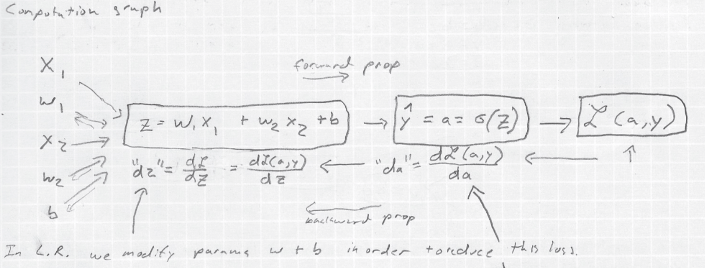

This past fall I took a course on Neural Networks and Deep Learning from Andrew Ng's DeepLearning.ai. It's provided through Coursera as course 1 of the [Deep Learning Specialization](https://www.coursera.org/specializations/deep-learning). 

I decided early on to take good notes on this course.  Here's an example:

I did this because I want to understand the fundamentals of Deep Learning really well. Like many others, I learn best when I challenge myself to comprehend well enough to explain the ideas to others. I found that taking notes having an audience in mind made the notes much more comprehensive and legible. 

My method was to imagine having to prepare a lecture on the material. If I thought something would be helpful or instructive I either wrote it down, reproduced the diagram, or added the side note. Taking notes in this way increased the time to complete the course by about 4 to 5 times. It really slowed me down. 

However, it was totally worth it. I feel like I understand the fundamentals much better than I would have otherwise. In fact, I have some evidence that careful note taking improved my comprehension. 

Sometimes I would watch all the videos for a section without taking notes, then go back later and take the notes on a second watch. Other times, I would take the notes on the first pass. In each case, I would attempt the section's quiz after only one viewing of the lectures. The times when I only watched the videos I would typically get 80% on the quiz. When I took notes I would typically get 100% or 90%. Each time I was only viewing the videos once but I retained much more of the detail when taking notes. 

I had a similar experience with the homework assignments. If I had taken notes the homework went much faster. If I had only watched the videos and gone back and taken notes only after completing the homework, it took me 2 to 3 times as long to complete the homework. 

I'm posting my notes here so as to make the imaginary audience in my mind more real. I will post note for other courses in the future because that's the motivation I need to write more clearly. I have nearly illegible handwriting when taking notes just for myself so I won't be surprised if you consider even these carefully taken notes rather messy. They represent a huge improvement over what I would have done otherwise and that was my goal. Always get better.

My notes for [Neural Networks and Deep Learning](https://www.coursera.org/learn/neural-networks-deep-learning):

[Deep Learning Week 1 Notes.pdf](Deep_Learning_Week_1.pdf)

[Deep Learning Week 2 part 1 Notes.pdf](Deep_Learning_Week_2_part_1.pdf)

[Deep Learning Week 2 part 2 Notes.pdf](Deep_Learning_Week_2_part_2.pdf)

[Deep Learning Week 3 Notes.pdf](Deep_Learning_Week_3.pdf)

[Deep Learning Week 4 Notes.pdf](Deep_Learning_Week_4.pdf)

